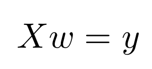

<center>
<h1>
In The Name Of ALLAH
</h1>
<h2>
Advanced Programming - Homework 1
</h2>
<h2>
Dr.Amir Jahanshahi
</h2>
<h3>
Deadline: Friday, 15 Esfand - 23:00
</center>


# Introduction
In this exciting homework you are going to find out an exact formula for a curve! After hours of experiments, some former AP students have invented an electrical element in which the current and voltage measurements are as shown in the below figure.


These data are presented in the ```data.txt```. In this homework you will be finding a formula for this. How exciting!!!

The first number in each row of ```data.txt``` is the current and the second number is the voltage. By visual inspection, we think that the voltage is made of a constant number, the current, sinus of the current, and the square root of the current. But we don't know how much each of these terms contribute. In other words, we don't know their coefficients. So we must find them!

One of the best methods for this kind of problems is the **least squares** or **normal equation** method. For each sample (measurment) we put a **1** (for the bias part), the current, the sinus of the current and the square of the current in rows of a matrix and we call it **X**. And we put the corresponding voltages in a column vector called **y**. The unknown coefficients are in a vector called **w**. So we have



As we would see in the TA class, **w** is computed as


This is all you need for this homework!

# Matrix Operations
In order to do the homework, you must implement some basic matrix functions. First of all, we use a 2-dimensional ```vector``` to store matrices, so we define

```c++
using Matrix = std::vector<std::vector<double>>;
```

Now implement the following functions in the ```aphw1``` header and cpp files.

```c++
Matrix multiply(Matrix& a, Matrix& b);
Matrix transpose(Matrix& a);
double det(Matrix& a);
Matrix inv(Matrix& a);
void show(Matrix& a);  //  Shows the matrix in a beautiful way
```

#  Preparing Data
To read and prepare data, we define the following functions.

```c++
Matrix getData(char* filename);
Matrix getX(Matrix&);
Matrix gety(Matrix& data);
```

```getData``` gets a ```filename``` and reads it. In order to see how this function works let's call the first number of each line **x** and the second number **y**. This function should generate a matrix in which each row has 5 elements as the following.

**1, x, sin(x), sqrt(x), y**

```getX``` gets the matrix returned from ```getData``` and removes its last column. This last column is what we need ```gety``` to give us.

#  Solution
Last steps! Now implement the following function which gets the data filename and returns the **w** column vector (Matrix).

```c++
Matrix solve(char* filename);
```

# main File
You must not alter the **main.cpp** file at all. Just write all your codes in the **aphw1.cpp** and **aphw1.h**. Good luck!

